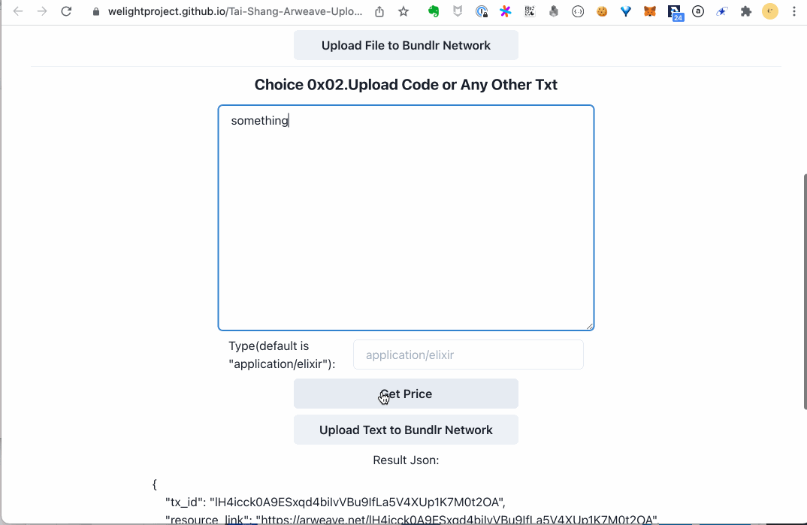
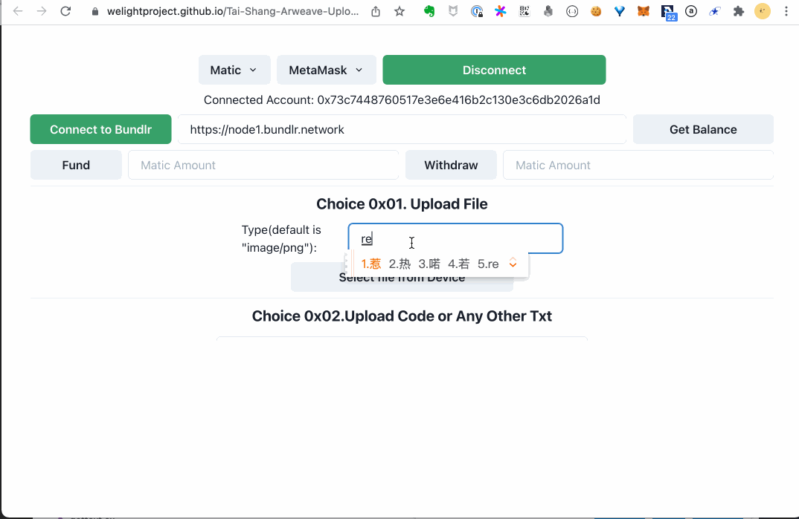
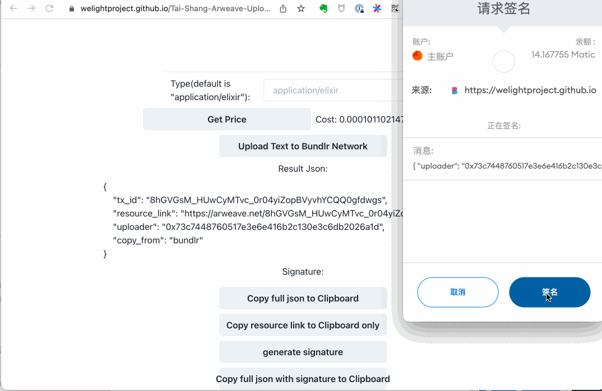
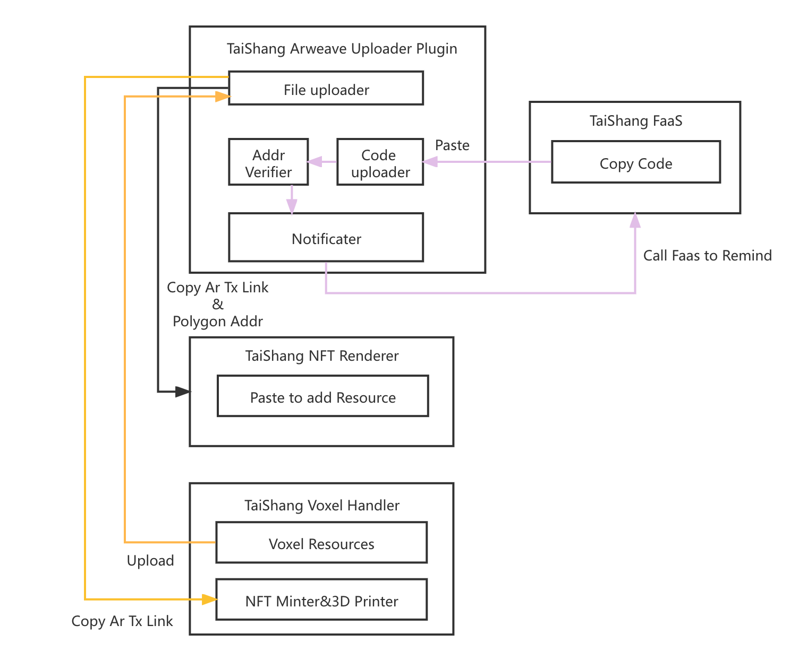
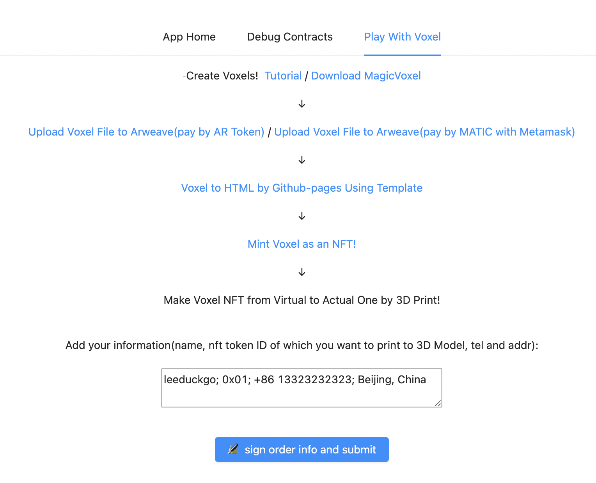

# Tai-Shang-Arweave-Uploader-Plugin

> Live Demo: https://welightproject.github.io/Tai-Shang-Arweave-Uploader-Plugin/

## Introduction

This app demonstrates usage of the [`bundlr-client`](https://github.com/Bundlr-Network/js-client) to facilitate a bridge for users in Polygon to easily store data into Arweave, packaging them into bundles using a bundler from the [Bundlr Network](https://bundlr.network) app, and dispatching them to the Arweave network.

## Quick Start

### Prepare environment

#### Node.js

Install Node.js LTS verison from its [offical website](https://nodejs.org/en/).

#### Yarn

Install Yarn from its [offical website](https://yarnpkg.com/).

#### Git

Install Git from its [offical website](https://git-scm.com/).

### Setup project

#### Clone project

Clone project from [WeLightProject/Tai-Shang-Arweave-Uploader-Plugin](https://github.com/WeLightProject/Tai-Shang-Arweave-Uploader-Plugin).

```sh
git clone https://github.com/WeLightProject/Tai-Shang-Arweave-Uploader-Plugin
```

#### Install dependencies

Run following command to install dependencies.

```sh
yarn install
```

### Start Project

You can run following commands.

```sh
yarn start
yarn build
yarn test
yarn predeploy
yarn deploy
```

## Prerequistes

### Arweave
[Arweave](https://www.arweave.org) is a permanent storage network that enables you to store documents and applications forever.

### Polygon
[Polygon](https://polygon.technology) is a decentralised Ethereum scaling platform that enables developers to build scalable user-friendly dApps with low transaction fees without ever sacrificing on security.

### Bundlr

> Bundlr is Bundlr, not Bundler!

[Bundlr](https://bundlr.network) is a multi-chain layer 2 solution for Arweave which enables native support for Arweave storage on different smart contract blockchains using those networks' native tokens for storage payment.

## Features

- Allow the user to upload files to Arweave with Matic payment.

- Allow two ways of uploading, adapted to the needs of different applications. For example:
  - code snippets uploading to FaaS -- text copy and paste
  
    
  
  - NFT uploading -- files and images
  
    
  
- Allow two ways of instant copying of the result
  - Copy only the link to the uploaded tx
  - Copy the full JSON as the followed format
    ```js
    {
        "tx_id": "balabala...",
        "resource_link": "https://arweave.net/",
        "uploader": "0x73c7448760517e3e6e416b2c130e3c6db2026a1d",
        "copy_from": "bundlr"
    }
  
- Allow user to verify their identity as resource uploader with MetaMask signing.

    Sign the above JSON with the `generate signature` button and provide the `Copy full JSON with signature` button to verify the identity of the resource uploader.
    
    

## As TaiShang ArweaveUploadPlugin

This app enables Polygon users to easily store either small quantity or large quantity data onto Arweave with the assistance of the bundlr-client. Data is packaged into bundles using a bundler from Bundlr Network and dispatched to the Arweave network.

In the TaiShang Projects ecosystem, this application is regarded as a kind of "plug-in", so that other projects related to Arweave in the ecosystem can easily upload data onto the Arweave network by jumping or embedding iframe plugins.
For example, as shown in the following structure diagram:



In this case, we use three examples of TaiShangArweaveUploaderPlugin to mark the interaction relationship with three different colors:

- **TaiShang FaaS**

Based on Arweave's FaaS system, code snippets written in languages such as Elixir/Rust can be pulled from the Arweave chain and loaded into Runtime to provide functional service support for other applications. Plugin is used for uploading code snippets.

- **TaiShang NFT Renderer**

TaiShang NFT renderer for rendering abstract NFTs. Plugin is used to upload resources.

- **TaiShang Voxel Handler**

TaiShang Voxel processor. Plugin is used to upload Voxel resources, convert Voxel Mint to NFT or transfer them to 3D printing device.

Online Demo

> https://leeduckgo.github.io/Tai-Shang-Voxel-Handler/play_with_voxel


